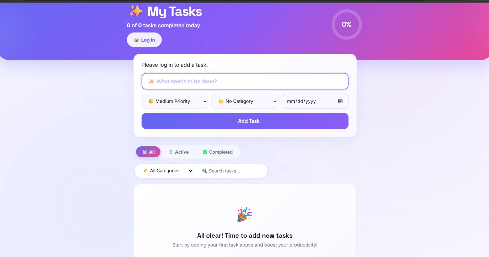

# Todo App

A Django todo app with categories, priorities, due dates, search, and filtering.

# home page




## Setup

```bash
python -m venv venv
source venv/bin/activate      # Windows: venv\Scripts\activate
pip install -r requirements.txt
python manage.py migrate
python manage.py runserver
```

Visit http://127.0.0.1:8000/

Four categories (Work, Personal, Shopping, Health) are seeded automatically
by the migrations. Optionally create an admin login:

```bash
python manage.py createsuperuser
```

Then visit http://127.0.0.1:8000/admin/ to manage todos and categories directly.

## Features

- Add todos with a title, priority (low/medium/high), due date, and category
- Toggle complete/incomplete, delete
- Filter by All / Active / Completed
- Filter by category, search by title
- Progress ring in the header shows how much of today's list is done
- Overdue todos are flagged automatically
